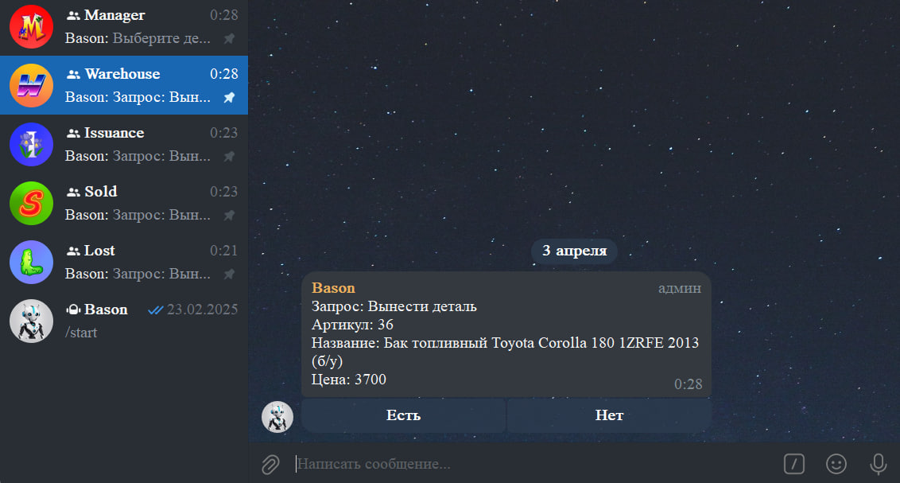

# Bason Telegram Bot 🤖

Bason is a Telegram bot designed to streamline the process of managing and tracking details (parts) across multiple specialized chats:

- **Manager Chat:** Initiates requests (e.g., checking availability, requesting items).
- **Warehouse Chat:** Confirms availability and forwards items to the next stage or marks them as lost.
- **Issuance Chat:** Marks items as sold or returns them to the warehouse.
- **Sold Chat:** Collects all sold items.
- **Lost Chat:** Collects all lost or missing items.

This structure helps automate the workflow of requesting, approving, and tracking parts within an organization.

## Screenshot



*Example screenshot of the Bason Telegram Bot in action.*

## Features

- **Multi-Chat Integration:**  
  The bot routes messages and actions among various Telegram chats, each handling a specific part of the workflow.

- **Availability Checks:**  
  Warehouse operators can confirm or deny the availability of requested parts.

- **Issuance and Sales Tracking:**  
  Issued parts can be marked as sold or returned to the warehouse, and all sold parts are automatically collected in a dedicated chat.

- **Lost Parts Management:**  
  Missing or unavailable parts are automatically noted in a separate “lost” chat for further action.

- **Simple and Extensible:**  
  The bot’s logic is built on top of the [Aiogram](https://docs.aiogram.dev/) framework, making it easy to extend and maintain.

## Getting Started

### Clone the Repository

```bash
git clone https://github.com/yourusername/bason-telegram-bot.git
cd bason-telegram-bot
```

## Create and Activate a Virtual Environment (optional but recommended)

**On Windows:**
```bash
python -m venv venv
venv\Scripts\activate
```

**On Linux/MacOS:**

```bash
python3 -m venv venv
source venv/bin/activate
```

## Install Dependencies

```bash
pip install -r requirements.txt
```

## Configure Environment Variables

Create a `.env` file (or edit the existing one) and set the following variables:

```ini
TOKEN=YOUR_TELEGRAM_BOT_TOKEN
API_URL=YOUR_API_ENDPOINT
AUTH_API_URL=YOUR_AUTH_ENDPOINT
API_LOGIN=YOUR_LOGIN
API_PASSWOED=YOUR_PASSWORD
WAREHOUSE_CHAT_ID=123456
MANAGER_CHAT_ID=123456
ISSUANCE_CHAT_ID=123456
LOST_CHAT_ID=123456
SOLD_CHAT_ID=123456
```

## Run the Bot

```bash
python main.py
```

## Usage

**Manager Chat:**  
Use `/start` or predefined menu buttons to request part checks or retrieval.

**Warehouse Chat:**  
Receives requests from the manager chat and updates availability status.

**Issuance Chat:**  
Handles final sales or returns of parts.

**Sold / Lost Chats:**  
Collect logs of sold or lost parts for record-keeping.

## Contributing

1. Fork the repository.
2. Create a new branch: `git checkout -b feature/my-feature`
3. Make your changes and commit them: `git commit -m 'Add some feature'`
4. Push to your branch: `git push origin feature/my-feature`
5. Create a Pull Request.

## License

This project is licensed under the MIT License. Feel free to modify and distribute it as you see fit.

---

Enjoy automating your parts management with Bason Telegram Bot!
